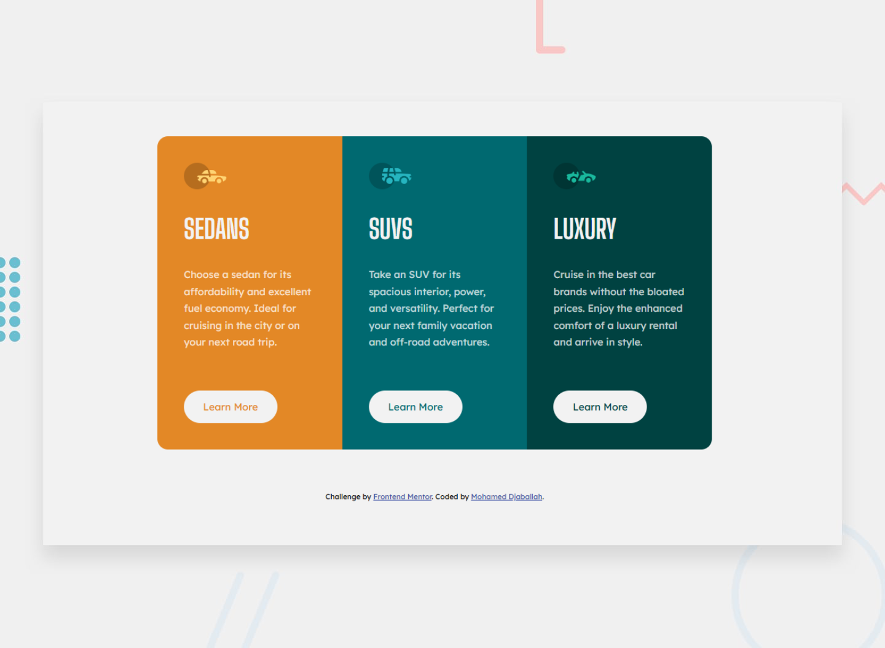

# Frontend Mentor - 3-Column Preview Card Component

This is my solution to the [3-column preview card component challenge](https://www.frontendmentor.io/challenges/3column-preview-card-component-pH92eAR2-) on [Frontend Mentor](https://www.frontendmentor.io/profile/Djabouex).  
I designed and developed this project entirely by myself as a personal challenge to improve my front-end skills.

---

## 📑 Table of Contents

- [Overview](#overview)
- [Links](#links)
- [My Process](#my-process)
- [Built With](#built-with)
- [What I Learned](#what-i-learned)
- [Continued Development](#continued-development)
- [Author](#author)
- [Acknowledgments](#acknowledgments)

---

## 🧐 Overview

### ✅ The Challenge

Users should be able to:

- View the optimal layout depending on their device's screen size.
- See hover states for interactive elements.

---

## 🔗 Links

- 💡 **Solution on Frontend Mentor**: [Click here](https://www.frontendmentor.io/solutions/responsive-3-column-card-using-css-grid-and-flexbox-eZPoPdYABl)
- 🚀 **Live Site**: [https://djabouex.github.io/3-column-preview-card-component/](https://djabouex.github.io/3-Column-Preview-Card-Component/)

---

## 🛠 My Process

I started by analyzing the layout and breaking it down into components. I then structured the HTML semantically and used CSS Grid and Flexbox for layout. Finally, I added custom properties and hover effects to meet the design.

---

## 🧱 Built With

- Semantic **HTML5** markup
- **CSS custom properties** (variables)
- **Flexbox**
- **CSS Grid**
- **Mobile-first workflow**

---

## 🚀 What I Learned

- Responsive layout design using **CSS Grid** and **Flexbox**
- Efficient use of **CSS variables** for theming and maintainability
- Creating smooth and clear **hover states**
- Applying typography from **Google Fonts** (Lexend Deca & Big Shoulders Display)
- Following a **style guide** and building pixel-perfect components

---

## 📚 Continued Development

I plan to:

- Improve accessibility by applying **WCAG** contrast checks
- Explore more **advanced CSS animations**
- Work on **component-based architectures** using JS frameworks in future challenges

---

## 👤 Author

- GitHub: [@Djabouex](https://github.com/Djabouex)
- Frontend Mentor: [@Djabouex](https://www.frontendmentor.io/profile/Djabouex)
- Name: **Mohamed Djaballah**

---

## 🙏 Acknowledgments

Thanks to the [Frontend Mentor](https://www.frontendmentor.io) community for providing challenges that help sharpen skills through real-world practice.

> 💡 This project was fully designed and coded by me as part of my journey to become a professional front-end developer.
